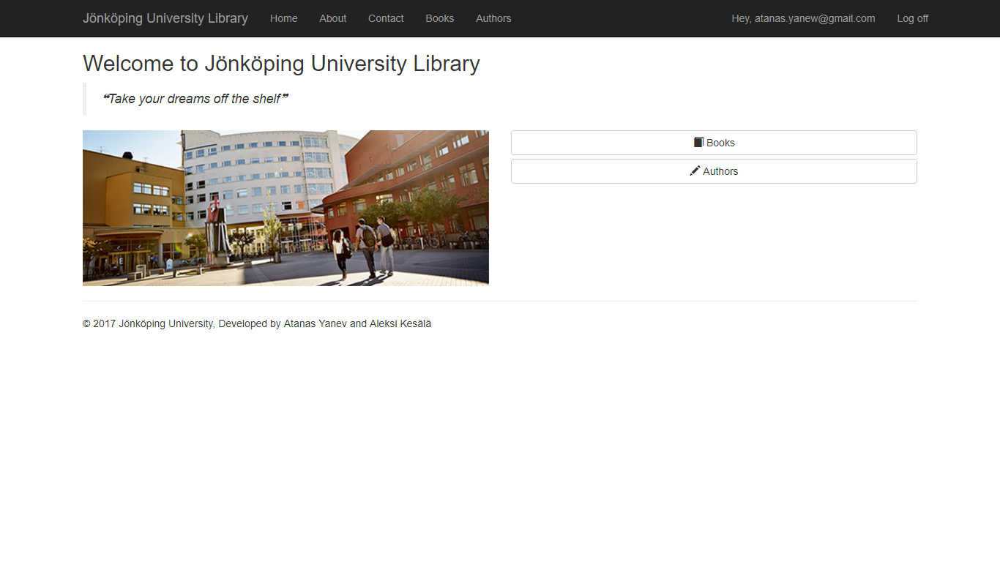
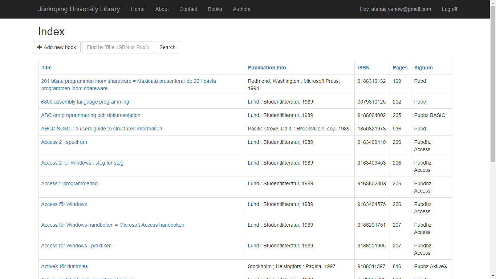
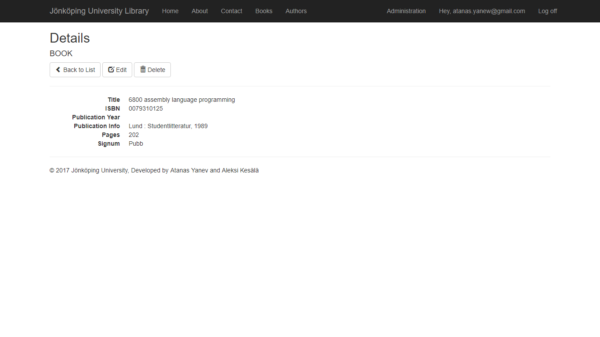
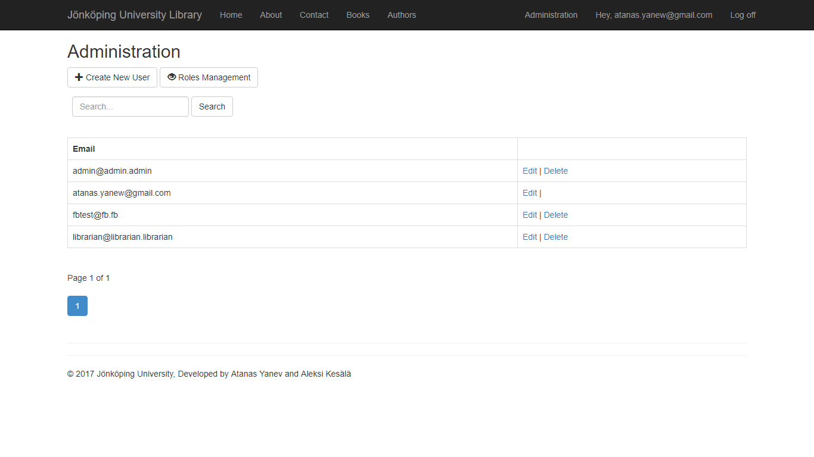
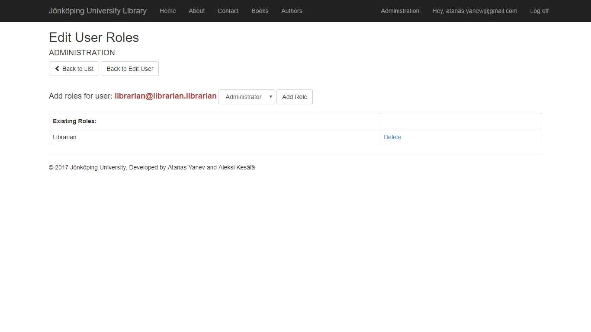

JKPG Library  
======
<!--

-->

### Description
School project in the course [Server-side Web Development (TPWK16)](http://ju.se/JTH/en/education/courses.html?courseCode=TPWK16&semester=20161&lang=en) at [Jönköping University](https://ju.se/). 
The course took place at Jönköping University during the spring of 2017.

> The public library here in Jönköping has ordered a website from us through which users should be able to browse the books and authors they have in their internal database. The library staff should also be able to login and apply CRUD (Create, Read, Update & Delete) operations on books and authors (each librarian should have her own account).

A library web platform in .NET MVC which communicates with an already existing database of a library system.
The platform make it possible for users to register and to browse, search and borrow available books.

### Screenshots

