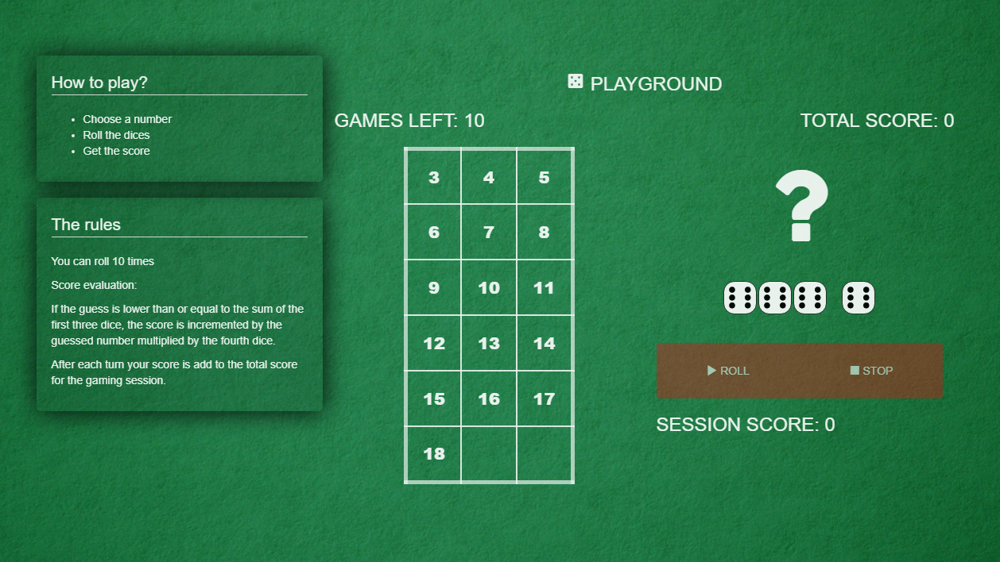
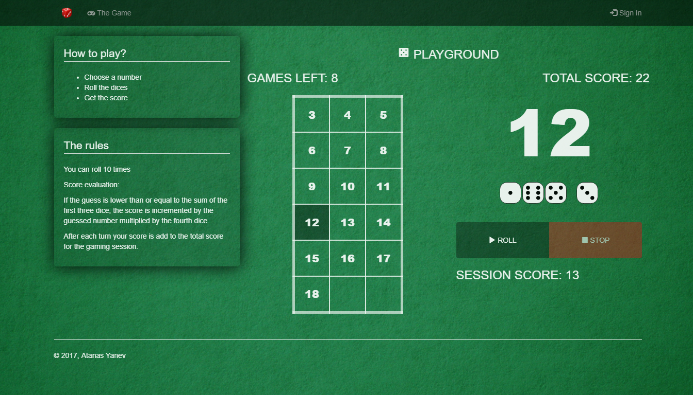
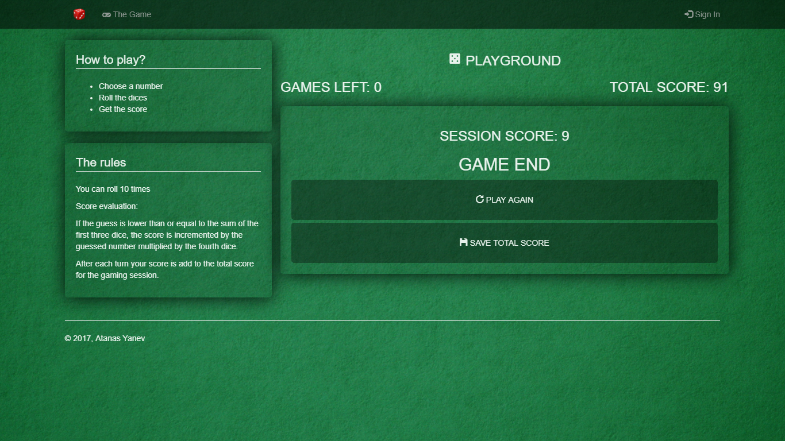
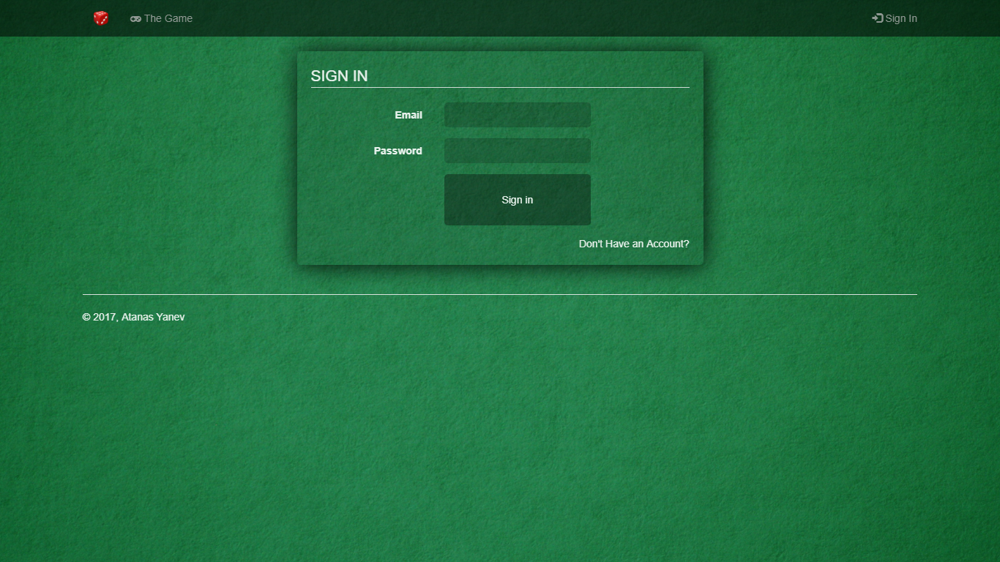
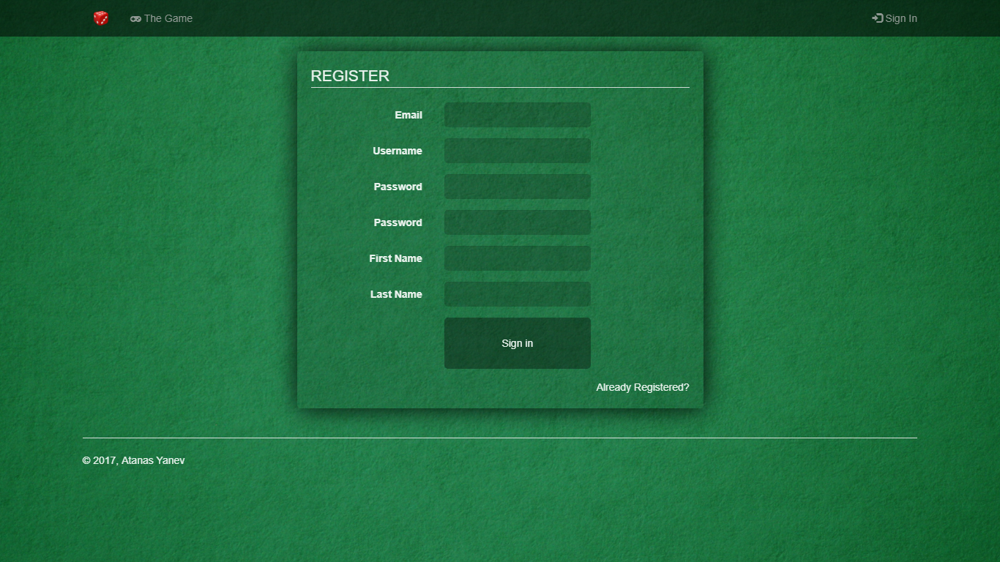

4Dice-Game 
======

### Description
Project work for course [Web Development with JavaScript and DOM (TWJK14)](http://ju.se/en/study-at-ju/courses.html?courseCode=TWJK14&semester=20141) at [Jönköping University](https://ju.se/)

>These instructions will guide you on your quest to create a simple website where a user can play a single player dice game. The game consists of four dice, and the user should guess the sum of the first three dice before throwing them all. If the user's guess turned out to be lower than or equal to the sum of the first three dice, his score should be incremented by the guessed number multiplied by the fourth dice. This should be repeated 10 times, after which the game is over.

### Screenshots

